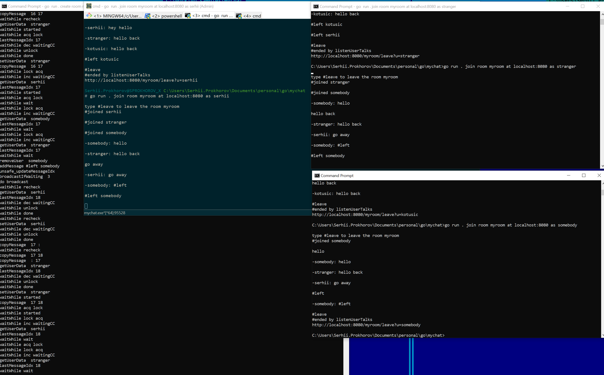

# go
## mychat
mychat is a very simple chat app written in go
### Usage
Starting a new room server at port 8080, room name myroom.
This command creates a new server process which listens on localhost:8080 for incoming HTTP connections
```
go mychat create room myroom at 8080
```

Joining the room myroom at localhost port 8080 with user name serhii
This command starts a new process which communicates to a room server at address localhost:8080, messages will be shown in the room as created by serhii
```
go run . join room myroom at localhost:8080 as serhii
```
Multiple users may join this run in the same way simultaneously.
Any message produced by a user A will be delivered to all other users.



### Purpose
This is very simple chat implementation, written by me for educational purposes.
No protection from misbehaving client, DDOS, sensitive data exposure have been made whatsoever.
This whole code purpose is only to learn myself of a cool GO features, like channels, locking, pointers and so on.

### How it works
Server listens on a given port for the following endpoints:
* http://localhost:8080/join?u={url encoded user name}
* http://localhost:8080/leave?u={url encoded user name}
* http://localhost:8080/say?u={url encoded user name}&b={url encoded text}
* http://localhost:8080/listen?u={url encoded user name}

There are two arrays the server maintains:
* users: map of url decoded user names, each name is associated to a user data; user data is just a very last message id delivered to this client
* messages: plain array of 1000 messages, each new message is added to the end of it, rolls over on overflow

On join, the server adds a user into the users map and updates user data to a very last message index (i.e. this user will inly see messase created LATER).
On leave, the server removes a user from the users map
On say, the server adds the messages into the messages array; if there are listen requests pending response, the server broadcastst the message for them (see listen command below)
On listen, the server compares current message index with this user data:
* if user data's message index is different, then this client receives new messages in a response to listed command
* if user data's message index is the same as current message index (there are no new messages), 
then the server blocks the response and waits on conditional variable for a broadcast message

### Command Listen explained
HTTP is a one way protocol. One end initiates the call, other end listens.
So the client may only implement a poll logic to receive new messages from the server.
Naive poll is ineffective in this case, HTTP request is expensive.
One way to reduce costs is to slower poll interval, which increases delay and so not good.
Another way is to block the request server side until new messages arrived.
This code implements exactly this:
* the client uses a separate thread to execute listen command (i.e. no other client's activity is blocked if listen is blocked)
* the client calls listen endpoint in a loop
* the client makes calls listen endpoint and gets blocked
* the server receives listen call and blocks it if there are no new messages
* the server uses conditional variable to implement wait/broadcast on single producer/multiple consumers
* new message arrives (say request from other user or from the same user) and the server updates message index and broadcasts an event for those who awaits (blocked listen calls)
* each of prev blocked listen calls are now unblocked and all new messages are included into their responses
* the client is unblocked, prints out the response
